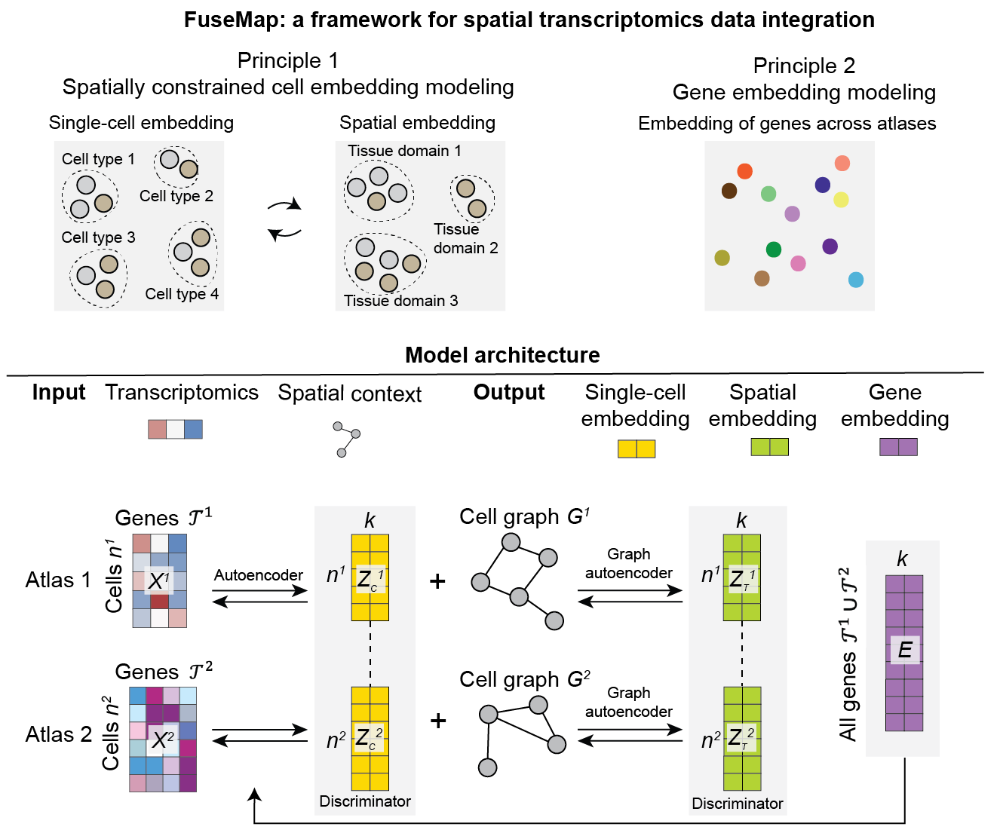

# FuseMap

Integrate multiple spatial transcripomics by generating universal gene, cell, and tissue embeddings.




For more details, please check out our publication.


## Directory structure

```
.
├── fusemap                 # Main Python package
├── data                    # Data files
├── experiments             # Experiments and case studies
├── docs                    # Documentation files
├── custom                  # Customized third-party packages
├── paper_code              # Code used in the manuscript
├── env.yaml                # Reproducible Python environment via conda
├── pyproject.toml          # Python package metadata
├── LICENSE
└── README.md
```

## Manuscript code and data
- For code and data in the manuscript 'Towards a universal spatial molecular atlas of the mouse brain', please go to [paper_code](paper_code/).

- For exploratory analysis of the molCCF, we provide an [interactive online database](http://fusemap.spatial-atlas.net/).

## Installation

> git clone https://github.com/wanglab-broad/FuseMap.git
> 
> cd FuseMap
> 
>pip install -e.

For the environment, to use .yml file:
`conda env create -f environment.yml`. This will create an environment named ClusterMap with required packages.


## Tutorial

- We are currently uploading more files for packaging and testing and will finish update soon.
- Read a more detailed tutorial [here](./Tutorial.md).


## Citation

If you find FuseMap useful for your work, please cite our paper: 

> x
